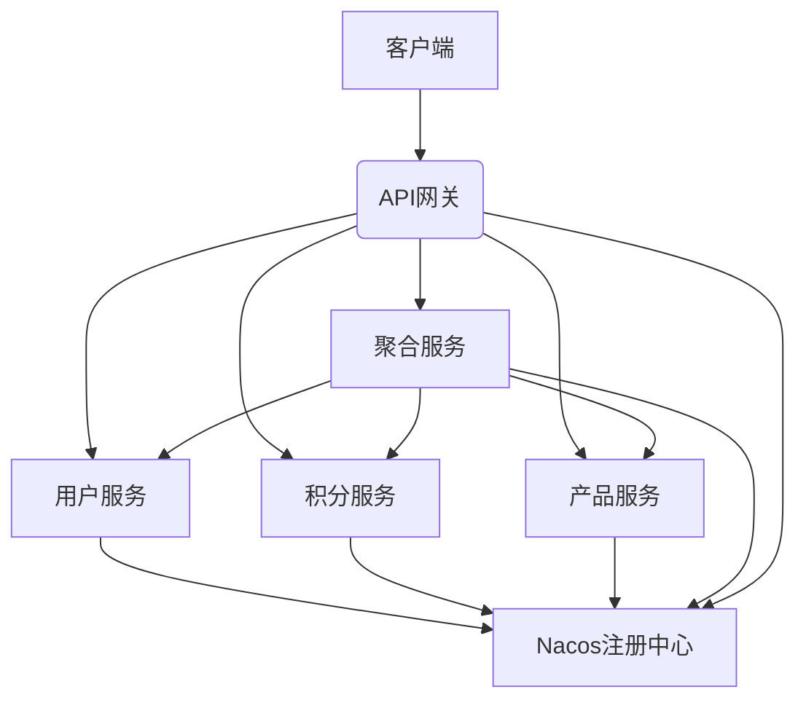

# 银行移动端聚合项目

本文档详细说明了银行移动端聚合项目的架构、功能、启动方式和使用方法。

## 项目概述

本项目是一个基于微服务架构的银行移动端应用，采用Spring Cloud Alibaba技术栈构建，包含以下模块：

- API网关 (api-gateway) - 统一入口，负责请求路由和转发
- 聚合服务 (aggregation-service) - 聚合多个基础服务的数据，提供统一的数据接口
- 用户服务 (user-service) - 管理用户基本信息
- 积分服务 (point-service) - 管理用户积分信息
- 产品服务 (product-service) - 管理银行产品信息
- 公共模块 (common) - 包含共享的数据模型、异常处理和响应封装

## 技术架构

- **核心框架**：Spring Boot 3.0.8, Spring Cloud 2022.0.0, Spring Cloud Alibaba 2022.0.0.0
- **服务注册与发现**：Nacos
- **服务调用**：OpenFeign
- **负载均衡**：Spring Cloud LoadBalancer
- **熔断降级**：Sentinel
- **API网关**：Spring Cloud Gateway
- **参数校验**：Jakarta Validation
- **日志框架**：SLF4J + Logback

## 功能特性

### 核心功能
1. **用户信息管理** - 提供用户基本信息查询
2. **积分信息管理** - 提供用户积分查询
3. **产品信息管理** - 提供银行产品信息查询和推荐
4. **数据聚合服务** - 并发调用多个基础服务，聚合首页数据
5. **统一API网关** - 提供统一入口和路由转发

### 技术特性
1. **统一响应格式** - 所有API接口返回统一格式的响应数据
2. **全局异常处理** - 统一处理系统异常，返回友好的错误信息
3. **参数校验** - 对接口参数进行校验，确保数据有效性
4. **服务容错** - 集成Sentinel实现服务熔断和降级
5. **负载均衡** - 支持服务间调用的负载均衡
6. **健康检查** - 提供各服务的健康状态监控接口
7. **并发处理** - 聚合服务使用CompletableFuture实现并发调用多个服务

## 系统架构图



## 启动前准备

### 1. 环境要求

- JDK 17 或更高版本
- Maven 3.6.x 或更高版本
- Nacos 2.2.1 或更高版本

### 2. 启动Nacos服务注册中心

项目依赖Nacos作为服务注册与发现中心，需要先启动Nacos：

1. 下载并安装Nacos Server
2. 启动Nacos：
   ```bash
   # Windows系统
   startup.cmd -m standalone
   
   # Linux/Mac系统
   sh startup.sh -m standalone
   ```

3. 确认Nacos启动成功：
   - 访问控制台: http://localhost:8848/nacos
   - 默认用户名密码: nacos/nacos

## 启动项目

### 方法一：通过IDEA启动（推荐开发阶段使用）

在IntelliJ IDEA中，按以下顺序启动各个服务：

1. 启动 `user-service` - 运行 [UserServiceApplication](file://D:\dev\bank-mobile-aggregation2\user-service\src\main\java/com/bank/user/UserServiceApplication.java#L6-L12)
2. 启动 `point-service` - 运行 [PointServiceApplication](file://D:\dev\bank-mobile-aggregation2\point-service\src\main\java/com/bank/point/PointServiceApplication.java#L6-L12)
3. 启动 `product-service` - 运行 [ProductServiceApplication](file://D:\dev\bank-mobile-aggregation2\product-service\src\main\java/com/bank/product/ProductServiceApplication.java#L6-L12)
4. 启动 `aggregation-service` - 运行 [AggregationServiceApplication](file://D:\dev\bank-mobile-aggregation2\aggregation-service\src\main/java/com/bank/aggregation/AggregationServiceApplication.java#L7-L14)
5. 启动 `api-gateway` - 运行 [ApiGatewayApplication](file://D:\dev\bank-mobile-aggregation2\api-gateway\src\main\java/com/bank/gateway/ApiGatewayApplication.java#L6-L12)

### 方法二：通过命令行启动（推荐测试/生产环境使用）

1. 在项目根目录编译打包：
   ```bash
   mvn clean install
   ```

2. 分别在不同的终端窗口执行以下命令启动各服务：
   ```bash
   # 启动用户服务
   java -jar user-service/target/user-service-1.0.0.jar
   
   # 启动积分服务
   java -jar point-service/target/point-service-1.0.0.jar
   
   # 启动产品服务
   java -jar product-service/target/product-service-1.0.0.jar
   
   # 启动聚合服务
   java -jar aggregation-service/target/aggregation-service-1.0.0.jar
   
   # 启动API网关
   java -jar api-gateway/target/api-gateway-1.0.0.jar
   ```

## 验证服务启动

### 1. 检查各服务健康状态

通过访问各服务的健康检查接口确认服务是否正常启动：

```
http://localhost:8081/actuator/health  # 用户服务
http://localhost:8082/actuator/health  # 积分服务
http://localhost:8083/actuator/health  # 产品服务
http://localhost:8084/actuator/health  # 聚合服务
```

### 2. 检查Nacos服务注册

访问Nacos控制台 http://localhost:8848/nacos 查看服务列表，应该能看到以下服务已注册：
- user-service
- point-service
- product-service
- aggregation-service
- api-gateway

## API接口说明

### 统一响应格式

所有API接口都返回统一格式的JSON响应：

**成功响应示例：**
```json
{
  "code": 0,
  "message": "success",
  "data": {
    // 具体数据
  },
  "timestamp": 1678901234567
}
```

**错误响应示例：**
```json
{
  "code": 400,
  "message": "请求参数校验失败",
  "data": null,
  "timestamp": 1678901234567
}
```

### 核心接口列表

#### 1. 用户服务接口
- `GET /api/users/{userId}` - 获取用户信息
- `GET /api/users/health` - 用户服务健康检查

#### 2. 积分服务接口
- `GET /api/points/user/{userId}` - 获取用户积分信息
- `GET /api/points/health` - 积分服务健康检查

#### 3. 产品服务接口
- `GET /api/products/recommended` - 获取推荐产品列表
- `GET /api/products/{productId}` - 获取产品详情
- `GET /api/products/health` - 产品服务健康检查

#### 4. 聚合服务接口
- `GET /api/homepage/{userId}` - 获取首页聚合数据
- `GET /api/homepage/health` - 聚合服务健康检查

#### 5. 网关路由接口
通过API网关访问各服务：
- `GET /api/users/{userId}` - 直接访问用户服务
- `GET /api/points/user/{userId}` - 直接访问积分服务
- `GET /api/products/recommended` - 直接访问产品服务
- `GET /api/homepage/{userId}` - 访问聚合服务

## 测试接口

### 直接访问各服务接口

1. 获取用户信息：
   ```
   GET http://localhost:8081/api/users/1
   ```

2. 获取用户积分：
   ```
   GET http://localhost:8082/api/points/user/1
   ```

3. 获取推荐产品：
   ```
   GET http://localhost:8083/api/products/recommended?userId=1
   ```

### 通过网关访问聚合服务

获取首页聚合数据（移动端实际使用的接口）：
```
GET http://localhost:8080/api/homepage/1
```

预期返回结果包含用户信息、积分信息和推荐产品列表。

### 通过网关直接访问各服务

```
GET http://localhost:8080/api/users/1
GET http://localhost:8080/api/points/user/1
GET http://localhost:8080/api/products/recommended?userId=1
```

## 端口分配

| 服务名称 | 端口号 | 说明 |
|---------|--------|------|
| API网关 | 8080 | 统一入口 |
| 用户服务 | 8081 | 用户信息管理 |
| 积分服务 | 8082 | 积分信息管理 |
| 产品服务 | 8083 | 产品信息管理 |
| 聚合服务 | 8084 | 数据聚合服务 |

## 注意事项

1. 确保端口未被占用（8080-8084）
2. 确保Nacos服务先于微服务启动
3. 如果遇到连接问题，请检查Nacos地址配置是否正确
4. 各服务之间通过Feign进行通信，确保网络连通性
5. 项目启动顺序不是强制性的，但由于服务间依赖关系，建议按上述顺序启动以避免启动过程中的错误信息
6. 所有API接口都支持参数校验，传入无效参数会返回相应的错误信息
7. 项目集成了Sentinel，具备服务熔断和降级能力
8. API网关默认只输出INFO级别及以上日志，如需调试可调整日志级别
9. 聚合服务通过并发调用优化了响应时间，但要注意线程池资源的合理使用

## 故障排除

### 常见问题

1. **服务无法注册到Nacos**
   - 检查Nacos是否正常启动
   - 检查application.yml中的Nacos配置是否正确
   - 检查网络连接是否正常

2. **Feign调用失败**
   - 检查被调用服务是否正常运行
   - 检查服务名称是否配置正确
   - 检查Feign客户端接口定义是否正确

3. **聚合服务返回空数据**
   - 检查各基础服务是否正常运行
   - 检查Feign客户端返回值类型是否与实际服务返回一致
   - 检查聚合服务中的数据处理逻辑

### 日志查看

各服务均配置了详细的日志输出，可以通过查看日志来定位问题：
- 用户服务日志：user-service/logs/
- 积分服务日志：point-service/logs/
- 产品服务日志：product-service/logs/
- 聚合服务日志：aggregation-service/logs/
- 网关服务日志：api-gateway/logs/